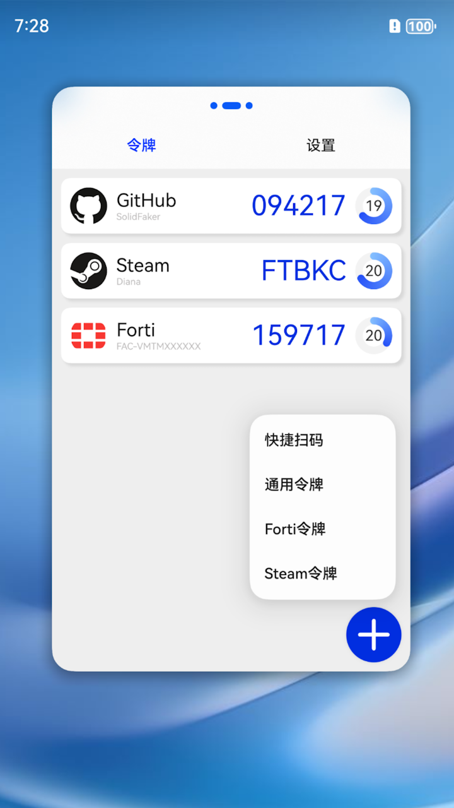

# OTP Token
Opensource OTP Authenticator for HarmonyOS Next

## Feature

- [x] Support TOTP Token
- [x] Support HOTP Token
- [x] Support Steam Token, [Importing from Steam](https://github.com/stratumauth/app/wiki/Importing-from-Steam)
- [x] Support Forti Token
- [x] Setting Page
- [ ] Asset Store Kit

---

  
  
  
  

---

## Reference
- [paolostivanin/libcotp](https://github.com/paolostivanin/libcotp)
- [Netthaw/TOTP-MCU](https://github.com/Netthaw/TOTP-MCU)
- [ss23/fortitoken-mobile-registration](https://github.com/ss23/fortitoken-mobile-registration)
- [andOTP/andOTP](https://github.com/andOTP/andOTP)
- [iamhyc/Aigis](https://github.com/iamhyc/Aigis)